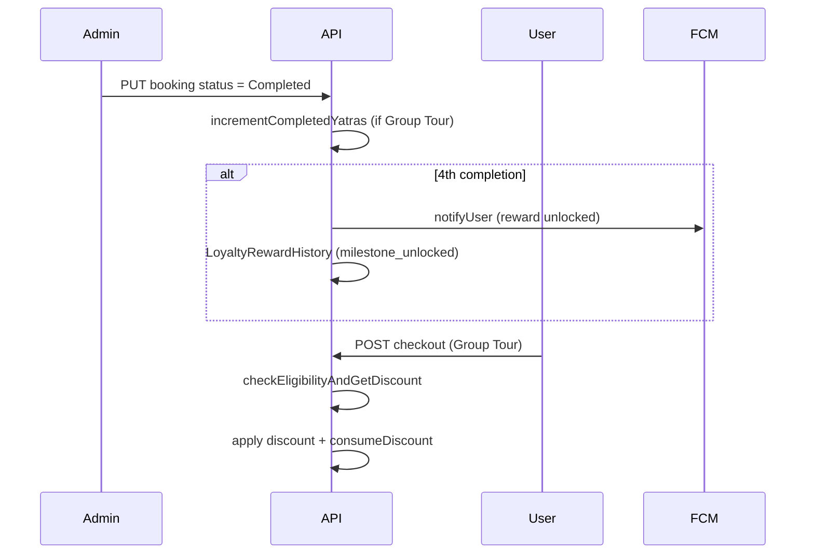
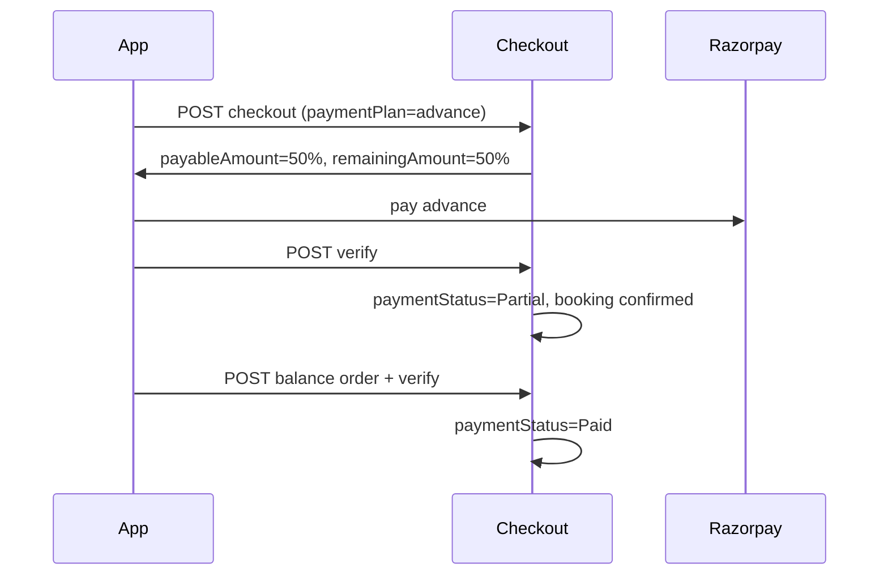

# Yatra Platform — Feature Architecture

## 1. Loyalty (Yatra Rewards)

**Models:** `User.yatraLoyalty`, `LoyaltyRewardHistory`

**APIs:**
- `GET /api/yatra-loyalty/status` — progress (0/4 … 4/4)
- `GET /api/yatra-loyalty/check-discount` — eligibility for checkout
- `GET /api/yatra-loyalty/history` — reward timeline
- Auto-apply in `POST /api/checkout/:userId` for Group Tours (2+ travelers)

**Rules:** Only `Group Tour` with `numberOfTravelers > 1` counts. Package/Individual tours excluded.

## 2. Aadhaar Auto-Fetch

**Service:** `aadhaarVerificationService.js` (provider: `mock` | `government`)

**API:** `POST /api/aadhaar/verify` — validates Verhoeff checksum, returns `fullName`

## 3. Multi-Language

**Languages:** `en`, `hi`, `mr`, `gu`

**Backend:** `User.preferences.language`, `PUT /api/locale/language`

**User app:** react-i18next + `LanguageSettingsScreen`

**Guild app:** `LanguageContext` + server sync

## 4. Offline Support

**User app:** `cacheManager`, `syncQueue`, `offlineSlice`, `OfflineIndicator`

Caches: profile, bookings, rewards (via AsyncStorage TTL). Sync queue replays on reconnect.

## 5. Dynamic Pricing

**Models:** `PricingRule`, `PricingAuditLog`

**Service:** `dynamicPricingService.js` — weekend, festival, demand, seat_availability, custom rules

**APIs:**
- `POST /api/pricing/calculate` — quote with breakdown
- Admin CRUD: `/api/pricing/rules`
- `GET /api/pricing/audit-logs`

Integrated into checkout; breakdown stored on `Booking.pricingBreakdown`.

## 6. 50% Advance Payment

**Fields:** `Booking.advancePaid`, `remainingAmount`, `paymentPlan`, `paymentStatus` (`Pending` | `Partial` | `Paid`)

**APIs:**
- Checkout: `paymentPlan: "advance"` → Razorpay charges 50%
- `GET /api/partial-payment/summary/:bookingId`
- `POST /api/partial-payment/balance/:bookingId`
- `POST /api/partial-payment/balance/verify`

## Environment Variables

| Variable | Purpose |
|----------|---------|
| `AADHAAR_PROVIDER` | `mock` or `government` |
| `AADHAAR_GOV_API_URL` | UIDAI-authorized API URL |
| `ADVANCE_PAYMENT_PERCENT` | Default `50` |
| `FCM_SERVER_KEY` | Push notifications for loyalty |
